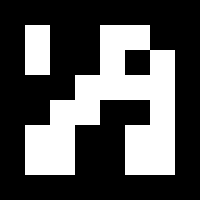
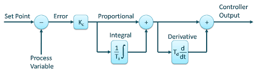

# drone_ros

## Introduction to Whycon Markers
WhyCon is a computer vision based system which can be used to localize mobile robots upto mm precision. Generally we use external localization systems based on GPS, ultrasound, IR, radio, multi camera systems. But they are expensive, complex and also may take more weight. So such systems cannot be used for small robots or swarms if we need a low-cost robot. 

Whycon markers solve this problem by using very less computation, low-cost camera and good precision in pose estimation. They are concentric circles with  a white background. It uses different image processing techniques to localize the robot and estimate the pose.

*For more information, visit this [repo](https://github.com/lrse/whycon).*

## Introduction to AruCo Markers
AruCo markers are binary sqaure matrices which are used for localization and pose estimation just like WhyCon markers. But the difference is  AruCo markers are more robust when compared to WayCon markers.

Let's consider a 7x7 AruCo marker.Divide it equally into rows and columns which will result in 7X7 blocks with binary colors. If we remove the outer black layer, we are left with a 5X5 matrix. In this, 1,3,5 coulmns are parity bits and 2,4 columns are data bits. So we will be left with 10 data bits which can give a combination of 2^10=1024 different AruCo markers. These markers can be used for pose estimation, camera caliberation and many more applications. We can also use these markers to direct a robot in a warehouse by giving different functionalities to different IDs.

## Open loop vs Closed loop
The main difference between open loop and closed loop control system is that a closed loop control system have feedback. So an open loop control system doesn't depend on the previous result.Whereas in a closed loop control system, the output depends on the control action of the system. It is complex but we can rely on the outputs.Best example for a closed loop control is cruise mode in a car.

## PID Controller

PID controller is one of the most used closed loop system in the industry. As the name shows, there are three components, they are Proportional, Integral and Derivative.These three components adds up and tries to get to the desired output.

Let's say we need a robot to move to a point which is 50m away. So the error will be 50 as we are at starting point. The proportional component makes the robot start with a higher speed as we have more error. As the robot moves, the speed decreases with decrease in error. Near the final point, the error will be approx. zero so the speed will be zero just on reaching the final point. 

But this concept doesn't work for all the cases. Let's say we need a drone to hover at 50m altitude. According the above example, the drone reaches 50m height perfectly. But as the error becomes zero, as per our concept it will stop. So the drone stops it motors and the drone will fall and again tries to rise up which will be like a bang-bang approach. Here integral component comes into picture.

Integral component accumulates the error and tries to stabilize the drone which will try to hover at 50m. But it cannot perfectly stabilize. It might overshoot a bit. So to reduce these small oscillations, the derivative component is used.

This is an overview of PID controller.

*Note:I will be updating the readme after the implementation of PID, AruCo and WayCon using ROS.*

